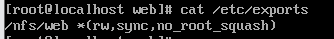
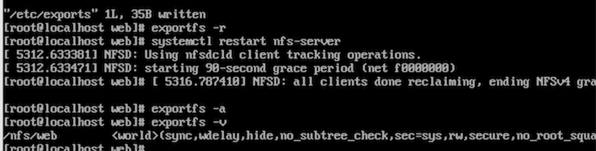
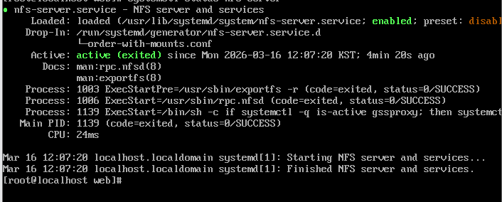
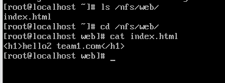
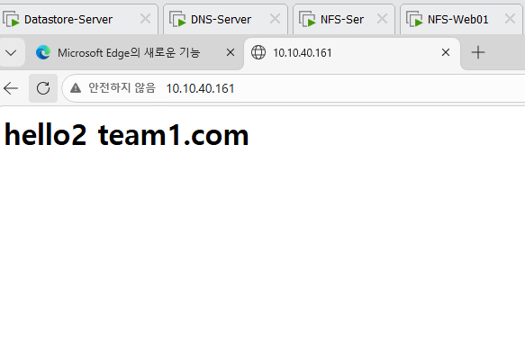
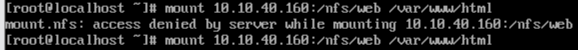
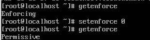
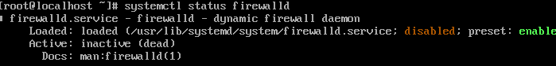

# 🚀 05 — 서비스 배포 및 구성

> **NFS 공유 스토리지를 활용한 고가용성 웹서비스 구축** — 웹 콘텐츠를 단일 NFS 스토리지에서 관리하여 모든 웹 서버가 동일한 데이터를 서비스하도록 구성했습니다.

---

## 환경 구성

| 역할 | VM 이름 | IP |
|------|---------|-----|
| NFS 서버 | NFS-Ser | 10.10.40.160 |
| 웹 서버 1 | NFS-Web01 | 10.10.40.161 |
| 웹 서버 2 | NFS-Web02 | 10.10.40.162 |
| 웹 서버 3 | NFS-Web03 | 10.10.40.163 |

웹 서버 3대는 모두 NFS 서버의 /nfs/web 디렉터리를 /var/www/html에 마운트하여 **동일한 콘텐츠를 서비스**합니다.

---

## 1. OVF 템플릿 기반 VM 배포

사전에 ESXi/vCenter에서 내보내기한 **OVF 템플릿**을 기반으로 Linux VM을 배포했습니다.
OVF 파일을 vCenter에서 가져오기(Import)하여 NFS 서버 및 웹 서버 VM 4대를 생성했으며,
배포 후 각 VM의 IP와 호스트명을 개별 설정했습니다.

| 자동 주입 항목 | 처리 방식 |
|----------------|-----------|
| IP / 서브넷 / 게이트웨이 | 배포 후 각 VM에서 수동 설정 |
| 호스트명 | 배포 후 개별 설정 |
| VMware Tools | OVF 템플릿에 사전 포함 |

---

## 2. vSphere 가상 스위치 구성


관리 트래픽과 서비스 트래픽을 분리하여 안정성을 높였습니다.

| 스위치 | 포트 그룹 | 연결 VM |
|--------|-----------|---------|
| vSwitch1 | 관리망 (vmk0: 10.10.10.100) | ESXi 호스트 관리 |
| vSwitch1 | VM Network | NFS-Ser, NFS-Web01/02/03, DNS-Server 등 7대 |
| vSwitch1 | vMotion-Network | vMotion 전용 |
| vSwitch2 | Internet-Network | Win-Server |

---

## 3. NFS 서버 구성 (NFS-Ser / 10.10.40.160)

### 3-1. 웹 콘텐츠 준비

```bash
[root@localhost web]# ls /nfs/web/
index.html

[root@localhost web]# cat /nfs/web/index.html
<h1>hello2 team1.com</h1>
```


### 3-2. /etc/exports 설정

```bash
[root@localhost web]# cat /etc/exports
/nfs/web  *(rw,sync,no_root_squash)
```



| 옵션 | 설명 |
|------|------|
| rw | 읽기/쓰기 허용 |
| sync | 디스크 쓰기 완료 후 응답 (데이터 안전성) |
| no_root_squash | 클라이언트 root를 서버 root로 매핑 허용 |

### 3-3. NFS 서비스 적용 및 확인

```bash
# 익스포트 목록 갱신
exportfs -r

# NFS 서버 재시작
systemctl restart nfs-server

# 현재 익스포트 목록 확인
exportfs -v
/nfs/web  <world>(sync,wdelay,hide,no_subtree_check,sec=sys,rw,secure,no_root_squash,no_all_squash)
```



```bash
# 서비스 상태 확인
systemctl status nfs-server
# ● nfs-server.service — Active: active (exited)
```



---

## 4. NFS 클라이언트 마운트 (웹 서버 VM 3대)

NFS-Web01(161), NFS-Web02(162), NFS-Web03(163) 각각에서 동일하게 마운트합니다.

```bash
# NFS 공유 마운트
mount -t nfs 10.10.40.160:/nfs/web /var/www/html

# 마운트 결과 확인
ls /var/www/html
# cgi-bin  html → html/

cd html/
cat index.html
# <h1>hello2 team1.com</h1>
```





---

## 5. 트러블슈팅: NFS-Web03 Access Denied

NFS-Web03(163)에서 마운트 시 **`access denied`** 오류가 발생했습니다.

### 증상

```bash
mount 10.10.40.160:/nfs/web /var/www/html
# mount.nfs: access denied by server while mounting 10.10.40.160:/nfs/web
```



### 원인 분석 및 조치

| 항목 | 상태 | 조치 |
|------|------|------|
| SELinux | **Enforcing** | Permissive 모드로 전환 |
| firewalld | **Active (Running)** | 중지 및 비활성화 |

```bash
# SELinux 상태 확인 → Enforcing
getenforce
# Enforcing

# SELinux Permissive 모드로 전환
setenforce 0
getenforce
# Permissive

# firewalld 중지 및 비활성화
systemctl stop firewalld
systemctl disable firewalld

systemctl status firewalld
# Active: inactive (dead) — disabled
```





> **원인**: SELinux의 NFS 보안 정책이 마운트 요청을 차단하고 있었음.
> 운영 환경에서는 semanage fcontext로 SELinux 정책을 세밀하게 조정하는 것을 권장.

### 해결 — 재마운트 성공

```bash
mount -t nfs 10.10.40.160:/nfs/web /var/www/html
# 정상 마운트 완료
```

---

## 6. 웹 서비스 동작 확인

브라우저에서 각 웹 VM IP로 접속하여 동일한 콘텐츠가 서비스됨을 확인했습니다.

```
http://10.10.40.161  →  hello2 team1.com  ✅
http://10.10.40.162  →  hello2 team1.com  ✅
http://10.10.40.163  →  hello2 team1.com  ✅
```


> **핵심 검증**: NFS 공유 스토리지의 **index.html** 파일 하나를 수정하면 **모든 웹 VM에 즉시 반영**됩니다.

---

## 7. NTP 서버 동기화

Windows Server를 도메인 NTP 서버로 구성하고, 전체 ESXi 호스트의 시간을 동기화했습니다.

```powershell
# Windows Server NTP 서버 설정
w32tm /config /manualpeerlist:"time.windows.com" /syncfromflags:manual /reliable:YES /update
net stop w32tm && net start w32tm
```